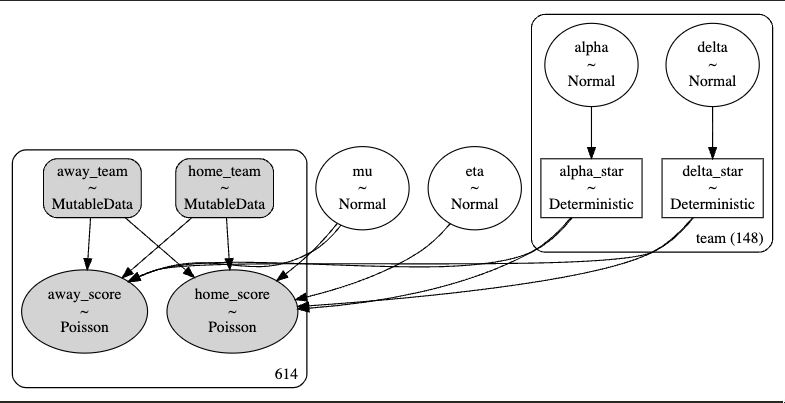
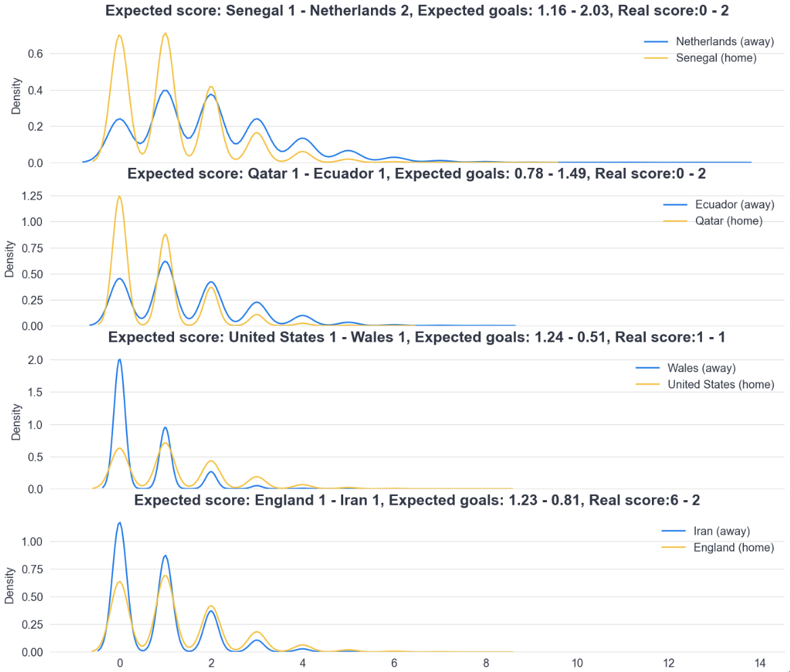
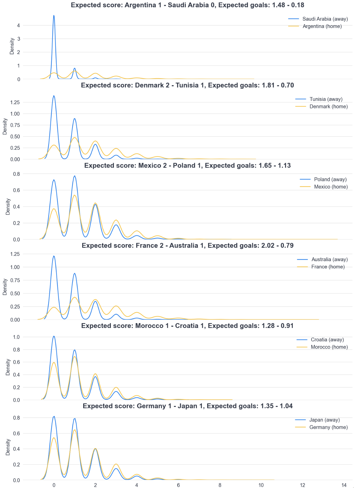

# Fifa World Cup 2022: Match Predictor

The aim of the project is to predict which team is going to win each match, in order to achieve that we scrapped data from ESPN results tab for each team (raw data folder), it contains the last 2 years of data of each team or in some cases only 1 year.

All the code and posterior checks of the model can be seen in the jupyter notebook.

# The Model

The vector of observed scores is $y = (y_{g}^{home}, y_{g}^{away})$ is modelled as independent Poisson:


$$
y_{g}^{j} | \theta_{g}^{j} ~ Poisson(\theta_{g}^{j})
$$

Where the parameters $\theta_{g}^{j}$  represent the scoring intensity in the $g-th$ game for the team playing at $j = home$ and $j = away$, respectively.

We model these parameters according to a formulation that has been used widely in the statistical literature (see Karlis & Ntzoufras 2003), assumming a log-linear random effect model:

$$
log(\theta_{g}^{home}) = \eta + \alpha_{h(g)} + \delta_{a(g)}
$$


$$
log(\theta_{g}^{home}) = \alpha_{h(g)} + \delta_{a(g)}
$$

The parameter $\eta$ represents the advantage for the team hosting the game and we assume that this effect is constant for all the teams and throughout the timewindow in our data. In addition, the scoring intensity is determined jointly by the attact and defense ability of the two teams involved, represented by the parameters $\alpha$ and $\delta$. The nested indexes $h(g)$, $a(g)$ identify the team that is playing at home (away) in the $g-th$ game.

As suggested by various works we need to impose some identifiability constraints on the team-specific parameters. We use a sum-to-zero constraint, that is:

$$
\sum_{t=1}^{T} \alpha_{t} = 0 \quad \sum_{t=1}^{T} \delta_{t} = 0
$$

Using PyMC probabilistic programming Framework we can build such model in just a few lines of code:

```python

home_idx = data['home_team'].map(team2id).values
away_idx = data['away_team'].map(team2id).values

coords = {"team": teams}

with pm.Model(coords=coords) as model:

    # Data inputs
    home_team = pm.MutableData("home_team", home_idx)
    away_team = pm.MutableData("away_team", away_idx)
  
    # Home field effect
    eta = pm.Normal("eta", mu=0, sigma=1)

    # Average score (log scale)
    mu = pm.Normal('mu', 0.4, sigma=1)

    # Team attack and defense skills
    alpha = pm.Normal("alpha", mu=0, sigma=1, dims="team")
    delta = pm.Normal("delta", mu=0, sigma=1, dims="team")
  
    # constrain the offense and defense skills to sum to zero
    alpha_star = pm.Deterministic("alpha_star", alpha - at.mean(alpha), dims="team")  
    delta_star = pm.Deterministic("delta_star", delta - at.mean(delta), dims="team") 
  
    # expected values for the home and away teams in each game can be calculated as
    home_theta = at.exp(mu + eta + alpha_star[home_team] + delta_star[away_team])
    away_theta = at.exp(mu + alpha_star[away_team] + delta_star[home_team])
  
    # the likehoods of the observed scores
    home_score = pm.Poisson(
        "home_score",
        mu=home_theta,
        observed=data["home_score"].to_numpy()
    )
    away_score = pm.Poisson(
        "away_score",
        mu=away_theta,
        observed=data["away_score"].to_numpy()
    )
```

The result is the following Hierarchical Model:



We trained the model with all matches previous to the world cup available in the data we collected and for testing purposes we checked the results against the first matches for which we have ground-truth labels.




# Predictions

We can easily simulate matches that haven't been played already with a few lines of code:

```python
# Predict future matches
home_teams = ['Argentina', 'Denmark', 'Mexico', 'France', 'Morocco', 'Germany']
away_teams = ['Saudi Arabia', 'Tunisia', 'Poland', 'Australia', 'Croatia', 'Japan']

home_teams_idx = [team2id[team] for team in home_teams]
away_teams_idx = [team2id[team] for team in away_teams]

with model:
    pm.set_data({
            "home_team": home_teams_idx,
            "away_team": away_teams_idx,
    
    })
    predictions = pm.sample_posterior_predictive(
        trace,
        predictions=True,
        random_seed=42,
    )
```




# Final comments

As we can see the model is not terrible but is not good either, there are a few points that can easily improve it:

1. The Home field effect is not the same in all matches, it depends on the type of the tournament.
2. As we don't have much data of teams from diferent regions playing each other, teams that are the strongest in relative weaker regions end up with biased strenght. We could collect more data or add some dependencies on the type of tournament when estimating strenght parameters.
3. We could add historic data to better capture teams that are usually strong, but also add time dependacy so that we can have higher weights for recent matches.

# About us

We continuously invest in researching IA 🤓, developing and delivering state-of-the-art data-centric AI systems ☕ with MLOps best practices. Check  our [webpage](https://replai.cl/)
